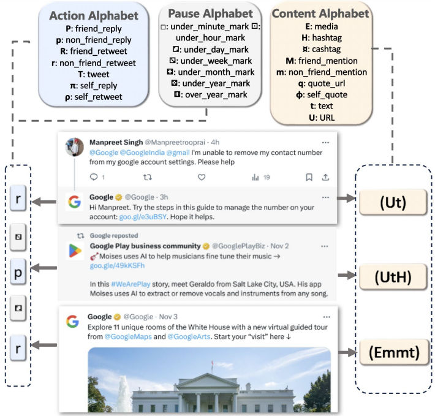
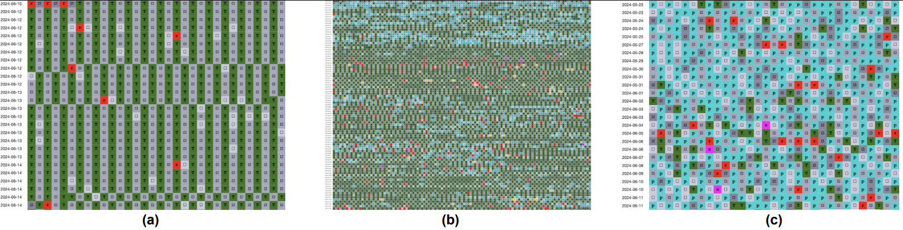
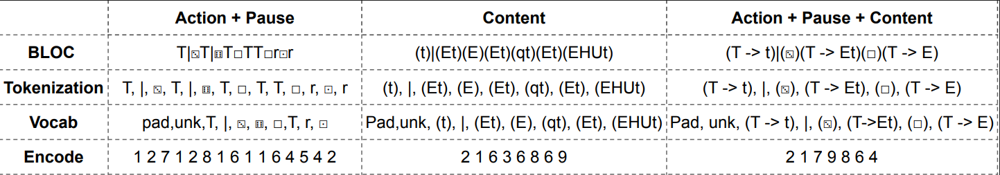
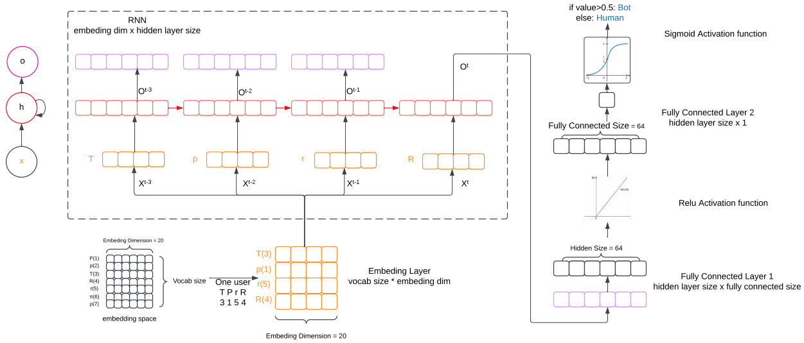
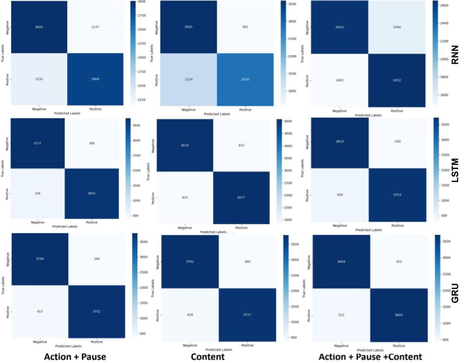

# Learning Behavioral Dynamics for Suspicious Activity Detection in Social Media

This project explores social media bot detection by modeling how user behavior evolves over time. Unlike traditional methods that rely on static features (e.g., profile data or posting frequency), our approach combines the Behavioral Languages for Online Characterization (BLOC) framework with LSTM networks to capture both actions and their temporal dynamics.

By translating raw social media activity into symbolic sequences and learning from their progression, the system can effectively distinguish human users and automated bots. Our experiments show that explicitly modeling behavioral dynamics leads to higher detection accuracy and greater resilience against adversarial tactics.

---

## 📂 Dataset
We use datasets from the [Bot Repository](https://botometer.osome.iu.edu/bot-repository/datasets.html), which include labeled human and bot accounts across multiple domains (political, commercial, general).  

- Total accounts: **40,604** (18,560 bots, 22,044 humans)
- Tweets analyzed: **10 million+**  

Data Preprocessing
- Each account is limited to its first 300 tweets, with a minimum threshold of 20 tweets.
- Tokenization and vocabulary creation for encoding BLOC strings.

### Dataset Summary  

| Source                | Bot   | Human | Total |
|-----------------------|-------|-------|-------|
| botometer-feedback-19 | 140   | 380   | 520   |
| botwiki-19            | 697   | 0     | 697   |
| cresci-17             | 7,295 | 2,770 | 10,065 |
| cresci-rtbust-19      | 352   | 340   | 692   |
| cresci-stock-18       | 7,104 | 6,178 | 13,282 |
| gilani-17             | 1,086 | 1,434 | 2,520  |
| midterm-18            | 0     | 7,459 | 7,459  |
| political-bots-19     | 62    | 0     | 62     |
| varol-17              | 736   | 1,497 | 2,233  |
| vendor-purchased-19   | 1,088 | 0     | 1,088  |
| verified-19           | 0     | 1,986 | 1,986  |
| **Total**             | 18,560| 22,044| 40,604 |

---

## 🧩 Methodology

### 1. BLOC Framework
BLOC encodes user behavior into symbolic “BLOC strings” using multiple alphabets:
- **Action Alphabet:** tweet, retweet, reply  
- **Content Alphabet:** hashtags, mentions, links  
- **Pause/Time Alphabet:** intervals between actions  

<p align="center">
  
</p>

This representation captures not only *what* actions were taken, but *when* and *how often*, revealing distinctive behavioral signatures.  

### 2. Capturing Behavioral Changes
- **Bots:** repetitive patterns with minimal variation with highly irregular shifts  
- **Humans:** moderate, organic variation  

<p align="center">
  
</p>  

### 3. Data Preprocessing
We experimented with three representations:  
1. **Action + Pause**  
2. **Content**  
3. **Combined Action + Content + Pause**  

Steps:  
- Tokenization (actions, pauses, content features)  
- Vocabulary mapping  
- Padding for sequence consistency  

<p align="center">
  
</p>  

### 4. Model Architectures
We trained three recurrent neural networks:  

- **Vanilla RNN** (baseline)  
- **LSTM** (handles long-term dependencies)  
- **GRU** (lightweight alternative)  

Each model includes:  
- Embedding layer (dim = 20)  
- Recurrent layer (RNN, LSTM, or GRU)  
- Fully connected layers + ReLU  
- Sigmoid output for binary classification  

<p align="center">
  
</p>  

---

## 📊 Results

| Model | Input Representation | Accuracy | F1-Score |
|-------|----------------------|----------|----------|
| RNN   | Action + Pause       | 83.85%   | 83.83%   |
| RNN   | Content              | 60.51%   | 60.44%   |
| RNN   | Combined             | 83.36%   | 83.36%   |
| LSTM  | Action + Pause       | **91.11%** | **91.11%** |
| LSTM  | Content              | 90.30%   | 90.30%   |
| LSTM  | Combined             | 88.65%   | 88.65%   |
| GRU   | Action + Pause       | 90.06%   | 90.06%   |
| GRU   | Content              | 88.90%   | 88.90%   |
| GRU   | Combined             | 86.67%   | 86.67%   |

<p align="center">
  
</p>  

---

## 💡 Discussion
- Temporal dynamics are crucial: **Action + Pause** was the most effective representation.  
- LSTM outperformed both RNN and GRU, thanks to its ability to model long-term dependencies.  
- Content-only features are insufficient on their own.  
- Combined features introduced noise, lowering performance slightly.  
- Future work: explore attention mechanisms or transformers for better temporal modeling.  

---

## ✅ Conclusion
This project demonstrates that **explicitly modeling behavioral dynamics** via BLOC + LSTM yields a robust and generalizable framework for detecting bots and suspicious accounts.  

- Best performance: **91.11% accuracy / F1-score with LSTM + Action + Pause input**.  
- Our approach offers resilience against adversarial tactics and lays the foundation for scalable, behavior-based monitoring systems.  

---

## 📖 References
- Nwala, A.C., Flammini, A., & Menczer, F. (2023). *A language framework for modeling social media account behavior*. EPJ Data Science, 12(1), 33.  
- Bot Repository Datasets: [https://botometer.osome.iu.edu/bot-repository/datasets.html](https://botometer.osome.iu.edu/bot-repository/datasets.html)  
- Giroux, J., Gangani, A., Nwala, A.C., Fanelli, C. (2024). *Unmasking social bots: How confident are we?* arXiv:2407.13929  

---

## 🚀 How to Run
1. Clone this repository  
   ```bash
   git clone https://github.com/your-repo/social-bot-detection.git
   cd social-bot-detection
